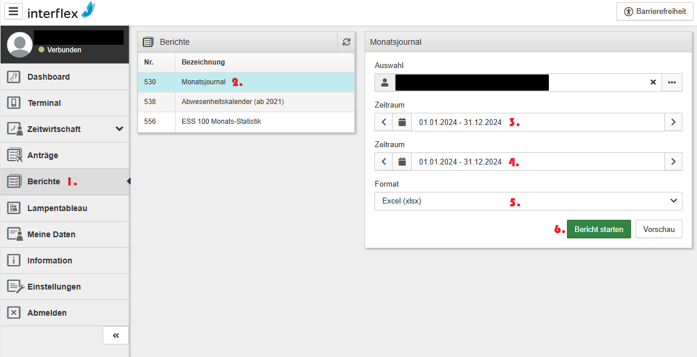

# Interflex Analyzer

Dieses Tool liest ein Monatsjournal Export im Excel-Format aus Interflex und parst die relevanten Zeilen mit Zeitbuchungen.

Das Tool erwartet ein vollständiges Jahresjournal und prüft die geparsten Daten auf Vollständigkeit (mind. ein Eintrag für jeden Tag im Jahr).

Anschließend werden die Home-Office- und Büro-Tage gezählt. Dabei gilt nur ein Tag als Home-Office-Tag, wenn keine Büroanwesenheit am gleichen Tag gebucht wurde. Das sollte den Ansprüchen der deutschen Steuergesetzgebung für die Home-Office-Pauschale entsprechen (keine Steuer- oder Rechtsberatung!).

Dieses Tool unterstützt ausdrücklich **nicht** die Auswertung von Tagen mit Dienstreisen jeder Art. Diese lassen sich aber leicht manuell auswerten, wenn nach der automatischen Auswertung das Protokoll ausgegeben wird.

